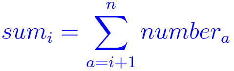

Now that we have learned some techniques with no to minor code modifications, we might want to tweak our actual code itself since there are chances we can do better. The way to determine what part of our code needs attention is called profiling. Profilers come in a variety of shapes and functionalities but what we'll use are two deterministic/event-based profilers as opposed to statistical profilers. This means that instead of relying on partial data by sampling at regular intervals, hit count will be exact and can be reproduced. The downside to using an event-based profiler is that is can slow down your code, sometimes significantly.

Here are some things to keep in mind before optimizing:

* Make sure your code works/is correct beforehand.
* Make sure you focus on the right code by profiling.
* Make and keep performance measurements along the way.
* Make the smallest changes possible at a time.
* Keep track of your code changes using Git.
* Always make sure your unit tests/your output is still valid.

We'll start with a simple example that can be found in the profile.py file:

~~~ {.python}
import sys
import time
import random

random.seed(time.time())

def gen_data(n):
    numbers = []
    for i in range(n):
        numbers.append(random.random())
    return numbers

def sum_nexts(numbers):
    sums = []
    for i in range(len(numbers)):
        for j in range(i+1, len(numbers)):
            if len(sums) < i+1:
                sums.append(0.)
            sums[i] = sums[i] + numbers[j]
    return sums

def main(n):
    numbers = gen_data(n)
    sums = sum_nexts(numbers)
    return sums

if __name__ == '__main__':
    if len(sys.argv) != 2:
        sys.stderr.write("Usage: {0} <n>\n".format(sys.argv[0]))
        sys.exit(1)

    n = int(sys.argv[1])
    main(n)
~~~

This small program takes a number n as input, generates n random elements in a list called numbers, and compute a list of n elements called sums, such as:

The first thing we want to do is make note of the time it takes to run the program. We'll start small, with a run of 10000 generated elements.

~~~ {.input}
$ time python profile.py 10000
~~~
~~~ {.output}
real    0m9.787s
user    0m9.745s
sys 0m0.025s
~~~

We're now ready to make our first profiling measurement to find our (possible) bottlenecks. For that, we'll use the recommended Python profiler: [cProfile](https://docs.python.org/2/library/profile.html#module-cProfile)

~~~ {.input}
$ python -m cProfile profile.py 10000
~~~
~~~ {.output}
         50045059 function calls in 15.072 seconds

   Ordered by: standard name

   ncalls  tottime  percall  cumtime  percall filename:lineno(function)
        1    0.000    0.000    0.000    0.000 __future__.py:48(<module>)
        1    0.000    0.000    0.000    0.000 __future__.py:74(_Feature)
        7    0.000    0.000    0.000    0.000 __future__.py:75(__init__)
        6    0.000    0.000    0.000    0.000 hashlib.py:100(__get_openssl_constructor)
        1    0.016    0.016    0.016    0.016 hashlib.py:56(<module>)
        1    0.003    0.003   15.072   15.072 profile.py:1(<module>)
        1   11.894   11.894   15.042   15.042 profile.py:13(sum_nexts)
        1    0.000    0.000   15.046   15.046 profile.py:22(main)
        1    0.003    0.003    0.004    0.004 profile.py:7(gen_data)
        2    0.000    0.000    0.001    0.000 random.py:100(seed)
        1    0.006    0.006    0.024    0.024 random.py:40(<module>)
        1    0.000    0.000    0.000    0.000 random.py:655(WichmannHill)
        1    0.000    0.000    0.000    0.000 random.py:72(Random)
        1    0.000    0.000    0.000    0.000 random.py:805(SystemRandom)
        1    0.000    0.000    0.001    0.001 random.py:91(__init__)
        1    0.000    0.000    0.000    0.000 {_hashlib.openssl_md5}
        1    0.000    0.000    0.000    0.000 {_hashlib.openssl_sha1}
        1    0.000    0.000    0.000    0.000 {_hashlib.openssl_sha224}
        1    0.000    0.000    0.000    0.000 {_hashlib.openssl_sha256}
        1    0.000    0.000    0.000    0.000 {_hashlib.openssl_sha384}
        1    0.000    0.000    0.000    0.000 {_hashlib.openssl_sha512}
        1    0.000    0.000    0.000    0.000 {binascii.hexlify}
        2    0.001    0.000    0.001    0.000 {function seed at 0x1018aa398}
        6    0.000    0.000    0.000    0.000 {getattr}
        6    0.000    0.000    0.000    0.000 {globals}
 50005002    2.881    0.000    2.881    0.000 {len}
        1    0.000    0.000    0.000    0.000 {math.exp}
        2    0.000    0.000    0.000    0.000 {math.log}
        1    0.000    0.000    0.000    0.000 {math.sqrt}
    19999    0.001    0.000    0.001    0.000 {method 'append' of 'list' objects}
        1    0.000    0.000    0.000    0.000 {method 'disable' of '_lsprof.Profiler' objects}
    10000    0.001    0.000    0.001    0.000 {method 'random' of '_random.Random' objects}
        1    0.000    0.000    0.000    0.000 {method 'union' of 'set' objects}
        1    0.000    0.000    0.000    0.000 {posix.urandom}
    10002    0.266    0.000    0.266    0.000 {range}
        1    0.000    0.000    0.000    0.000 {time.time}
~~~

You must remember that you can't compare run timings from profiled and non-profiled code. Profiling incurs an overhead and will usually be a lot slower (about 50% here). The default output is not useful as entries are in no particular order. What we want most of the time is function calls sorted by their reverse cumulative time. This can be accomplished by the following:

~~~ {.input}
$ python -m cProfile -o output.cprofile profile.py 10000
$ python
>>> import pstats; s = pstats.Stats("output.cprofile")
>>> s.sort_stats('cumulative').print_stats(10)
Wed Feb 10 10:28:35 2016    output.cprofile

         50045059 function calls in 15.208 seconds

   Ordered by: cumulative time
   List reduced from 36 to 10 due to restriction <10>

   ncalls  tottime  percall  cumtime  percall filename:lineno(function)
        1    0.001    0.001   15.208   15.208 profile.py:1(<module>)
        1    0.000    0.000   15.202   15.202 profile.py:22(main)
        1   12.022   12.022   15.197   15.197 profile.py:13(sum_nexts)
 50005002    2.910    0.000    2.910    0.000 {len}
    10002    0.265    0.000    0.265    0.000 {range}
        1    0.002    0.002    0.005    0.005 /Users/laurent/anaconda/envs/python2/lib/python2.7/random.py:40(<module>)
        1    0.003    0.003    0.005    0.005 profile.py:7(gen_data)
        1    0.002    0.002    0.002    0.002 /Users/laurent/anaconda/envs/python2/lib/python2.7/hashlib.py:56(<module>)
    19999    0.001    0.000    0.001    0.000 {method 'append' of 'list' objects}
    10000    0.001    0.000    0.001    0.000 {method 'random' of '_random.Random' objects}
~~~

We also want to save the output to a (binary) file, which we do here using the -o option. That way, we can manipulate the stats data afterwards. We also used the print_stats function in this example, with the 10 parameter indicating that we want only the top 10 hits. It's then possible to infer that most of the computation time, as expected, is taking place in the sum_nexts function. Beware that it might not always be so predictable and that you must profile before starting optimizing your code.

Also note the addition of the -o option, to redirect output to a file. This is almost always what you want when profiling a real software as there will be a lot of functions to display.

The problem when using cProfile is that it's view is very high-level. We know where to start looking, but we don't know the details of the function execution. To dig further, we need to use a line-based profiler called line_profiler. The line_profiler profiler needs manual instrumentation by adding a @profile decorator to functions we want to have a more detailed look at. This is mainly for performance reasons as profiling at line level the entire code would generaly be too costly.

~~~ {.python}
@profile
def sum_nexts(numbers):
    sums = []
    for i in range(len(numbers)):
        for j in range(i+1, len(numbers)):
            if len(sums) < i+1:
                sums.append(0.)
            sums[i] = sums[i] + numbers[j]
    return sums
~~~

We can start the profiler and run our program using the following:

~~~ {.input}
$ kernprof -l -v profile.py 10000
~~~
~~~ {.output}
Wrote profile results to profile.py.lprof
Timer unit: 1e-06 s

Total time: 31.2661 s
File: profile.py
Function: sum_nexts at line 13

Line #      Hits         Time  Per Hit   % Time  Line Contents
==============================================================
    13                                           @profile
    14                                           def sum_nexts(numbers):
    15         1            3      3.0      0.0      sums = []
    16      2939         1714      0.6      0.0      for i in range(len(numbers)):
    17  25068105      8827075      0.4     28.2          for j in range(i+1, len(numbers)):
    18  25065166     10874013      0.4     34.8              if len(sums) < i+1:
    19      2939         3654      1.2      0.0                  sums.append(0.)
    20  25065166     11559601      0.5     37.0              sums[i] = sums[i] + numbers[j]
    21                                               return sums
~~~

This makes it clear that a lot of the time is consumed by the (innocuously looking) if len(sums) < i+1 statement. It is not slow per say, but called 25 million times, it becomes significant. A simple change we can make is to initialise our result list before with zeros. This change would look like this:

~~~ {.python}
def sum_nexts(numbers):
    sums = [0.]*len(numbers)
    for i in range(len(numbers)):
        for j in range(i+1, len(numbers)):
            sums[i] = sums[i] + numbers[j]
    return sums
~~~

We removed the @profile decorator as we want to measure the impact of our change, by comparing to the original run time:

~~~ {.input}
$ time python profile.py 10000
~~~
~~~ {.output}
real    0m5.433s
user    0m5.410s
sys 0m0.017s
~~~

So we have a 50% gain just doing this small modification. Let's see if we can do better. We add the @profile back and run the line-level profiler again:

~~~ {.intput}
$ kernprof -l -v profile.py 10000
~~~
~~~ {.output}
Wrote profile results to profile.py.lprof
Timer unit: 1e-06 s

Total time: 8.33541 s
File: profile.py
Function: sum_nexts at line 13

Line #      Hits         Time  Per Hit   % Time  Line Contents
==============================================================
    13                                           @profile
    14                                           def sum_nexts(numbers):
    15         1           28     28.0      0.0      sums = [0.]*len(numbers)
    16      1152          566      0.5      0.0      for i in range(len(numbers)):
    17  10853166      3649381      0.3     43.8          for j in range(i+1, len(numbers)):
    18  10852014      4685433      0.4     56.2              sums[i] = sums[i] + numbers[j]
    19                                               return sums
~~~

That inner loop (j variable) sure seems to be a problem. Instead of iterating from i+1 to len(number)-1, we could use Python splicing to see if we get better performance.

~~~ {.python}
def sum_nexts(numbers):
    sums = [0.]*len(numbers)
    for i in range(len(numbers)):
        sums[i] = sum(numbers[i+1:])
    return sums
~~~

Having removed the @profile decorator again, we can test our hypothesis:

~~~ {.input}
$ time python profile.py 10000
~~~
~~~ {.output}
real    0m0.472s
user    0m0.460s
sys 0m0.010s
~~~

That's great! A 20x improvement since the beginning of the process. Let's see what our line-based profiler has to say:

~~~ {.python}
@profile
def sum_nexts(numbers):
    sums = [0.]*len(numbers)
    for i in range(len(numbers)):
        sums[i] = sum(numbers[i+1:])
    return sums
~~~

~~~ {.input}
$ kernprof -l -v profile.py 10000
~~~
~~~ {.output}
Wrote profile results to profile.py.lprof
Timer unit: 1e-06 s

Total time: 0.4534 s
File: profile.py
Function: sum_nexts at line 13

Line #      Hits         Time  Per Hit   % Time  Line Contents
==============================================================
    13                                           @profile
    14                                           def sum_nexts(numbers):
    15         1           27     27.0      0.0      sums = [0.]*len(numbers)
    16     10001         3639      0.4      0.8      for i in range(len(numbers)):
    17     10000       449733     45.0     99.2          sums[i] = sum(numbers[i+1:])
    18         1            1      1.0      0.0      return sums
~~~

This is what we want to see: almost all run time is the actual computation (sum), which is great. But still, since we are working with lists, why not use Numpy arrays and see what we can achieve? Here is a modified version using Numpy arrays instead is lists:

~~~ {.python}
import numpy

numpy.random.seed(int(time.time()))

def gen_data(n):
    return numpy.random.random(n)

def sum_nexts(numbers):
    sums = numpy.zeros(len(numbers))
    for i in range(len(numbers)):
        sums[i] = sum(numbers[i+1:])
    return sums
~~~

But running it yields an unexpected result. We are far worst than we were before those modifications:

~~~ {.input}
$ time python profile.py 10000
~~~
~~~ {.output}
real    0m4.331s
user    0m4.292s
sys 0m0.034s
~~~

Why? Let's ask our profiler:

~~~ {.input}
$ kernprof -l -v profile.py 10000
~~~
~~~ {.output}
Wrote profile results to profile.py.lprof
Timer unit: 1e-06 s

Total time: 4.21296 s
File: profile.py
Function: sum_nexts at line 10

Line #      Hits         Time  Per Hit   % Time  Line Contents
==============================================================
    10                                           @profile
    11                                           def sum_nexts(numbers):
    12         1           85     85.0      0.0      sums = numpy.zeros(len(numbers))
    13     10001         4114      0.4      0.1      for i in range(len(numbers)):
    14     10000      4208765    420.9     99.9          sums[i] = sum(numbers[i+1:])
    15         1            0      0.0      0.0      return sums
~~~

This is again expected, we spend all of our time doing the sum. But why is it slower? The answer is that we are still using the Python built-in sum function and not it's Numpy counterpart. That means the code goes back and forth between Python and C (Numpy). We can make the code execute longer in the Numpy library by using it's own sum function:

~~~ {.python}
def sum_nexts(numbers):
    sums = numpy.zeros(len(numbers))
    for i in range(len(numbers)):
        sums[i] = numbers[i+1:].sum()
    return sums
~~~

~~~ {.input}
$ time python profile.py 10000
~~~
~~~ {.output}
real    0m0.145s
user    0m0.112s
sys 0m0.029s
~~~

So in the end, we could get about 65 times faster in a really short amount of time.
